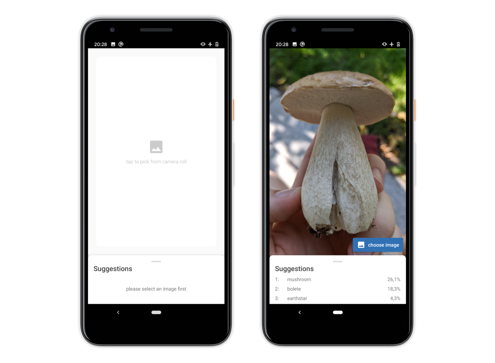

# TUM Lens

> TUM Lens is a front end for running image classification models on Android smartphones for evaluation and showcasing purposes.

### Screenshots



### Features
- classify live camera stream and images from gallery
- choose from multiple models
- toggle front and back camera
- double tap to pause classification 

---

# Running TUM Lens on your Android smartphone

### 1 Activate Developer Mode
1. Open Settings app.
2. If you run Android 9 or higher, go to "About Phone" and scroll down to "Build Number". Otherwise go to "System", then "About Phone" and scroll down to "Build Number".
3. Now, **tap 7 times** on **Build Number**.

Find additional information here: https://developer.android.com/studio/debug/dev-options

### 2 Clone Repository and open it in Android Studio
1. Clone the project with `git clone ...` inside a local repository or use GitLab's "Download Source Code" option.
2. In Android Studio, choose "File", "New" and "Import Project ..." and select the `TUM_lens` directory. Make sure that you do not select the root of this repository!


### 3 Connect your phone via cable
It should appear under "running devices" within the drop down in the upper menu bar of Android Studio.


### 4 Running the app
Build and run the app by clicking the green play button in the upper menu bar.


---

# Adding models
As a tool for rapid prototyping, TUM Lens is set up in such a way that additional models can be added without changing its Java code. However, the project must be re-build. 

1. Place your `.tflite` files in the `/assets` directory.
2. Open `nets.json` in `/assets`.
3. Find the `"nets": [ ... ]` array in that file.
4. Add your model to that array. You may want to use an existing object for reference. Please note the section below on mandatory parameters and precautions.
5. Now, save the file and re-build the project.

**Please note** that model file names must not contain any `.` except for separating filename and extension.
Otherwise, models will be compressed resulting in the app crashing!

#### Mandatory JSON Parameters
| Parameter          | Use                                                             |
| :-------------     | :-------------------------------------------------------------- |
|  `name`            | display name in *model selector*                                |
|  `top5accuracy`    | displayed as info in *model selector*                           |
|  `image_mean`      | *float* models require additional normalization in image pre-processing. Use `127.5f` for *float*, but `0.0` for *quantized* networks to bypass the normalization.|
|  `image_std`       | use `127.5` for *float* and `1.0` for *quantized* networks.     |
|  `probability_mean`| *float* models don't need dequantization in post-processing, set to `0.0` to bypass normalization. Use `0.0` for *quantized* models as well|
|  `probability_std` | use `1.0` for *float* and `255.0` for *quantized* networks      |
|  `filename`        | name of `.tflite` model file in `/assets`                       |
|  `labels`          | name of `.txt` labels file in `/assets`                         |


---

# Model Zoo
You can find model that were already converted into the *TF-Lite Model Format* in the `model_zoo` directory. E-Mail me to add your model to that list `:)`

| Model                        | Description                                                     |
| :----------------------------| :-------------------------------------------------------------- |
| `Inception V1`               | default Inception V1 net; converted for proof of concept        |
| `MobileNet V3 IIC`           | Transfer Learning use case for [Intel Image Classification](https://www.kaggle.com/puneet6060/intel-image-classification) Kaggle Challenge; based on [this](https://gitlab.com/mircotroue/slim-transfer-learning/-/tree/master) repository; see section below for more details; |
| `efficientnet-lite0-fp32`    | Float EfficientNet from *TensorFlow Hub*                        |
| `efficientnet-lite0-int8`    | Quantized EfficientNet from *TensorFlow Hub*                    |
| `mobilenet_v1_224`           | Float MobileNet V1 from *TensorFlow Hub*; Please note that this model is already integrated into the app by default! |
| `mobilenet_v1_224_quant`     | Quantized MobileNet V1 from *TensorFlow Hub*                    |


Find more image classification models for TF-Lite on [TensorFlow Hub](https://tfhub.dev/s?deployment-format=lite&module-type=image-classification)

---

# Converting (Transfer Learning) Models to TF-Lite

We look at the procedure using the following example: https://gitlab.com/mircotroue/slim-transfer-learning/. 

This *Transfer Learning* project is based around TF-Slim's *MobileNet V3 Large*, that has previously been trained on ImageNet. The new [domain](https://www.kaggle.com/puneet6060/intel-image-classification) consists out of six classes: 
1. buildings
2. forest
3. glacier
4. mountain
5. sea
6. street

For that, two adjustments were made to the code:
1. `nets/mobilenet/mobilenet_v3.py`: `num_classes=6` (see [here](https://gitlab.com/mircotroue/slim-transfer-learning/-/blob/master/nets/mobilenet/mobilenet_v3.py#L617))
2. `datasets/natural.py`: `_NUM_CLASSES = 6` (see [here](https://gitlab.com/mircotroue/slim-transfer-learning/-/blob/master/datasets/natural.py#L35))

### 1 Exporting the Inference Graph

The default [TF-Slim repository](https://github.com/tensorflow/models/tree/master/research/slim) includes `export_inference_graph.py`. Place this file in the root directory of the cloned repository and run:

```bash
python export_inference_graph.py \
	--alsologtostderr \
	--model_name=mobilenet_v3_large \
	--dataset_name=natural \
	--output_file=/tmp/transferlearning_inferencegraph.pb
```

**Please note**
For the adjustment of the *number of classes* to take effect, we have to specifiy both, the model *structure* and the *dataset* used.

This section is based on the [TF-Slim documentation](https://github.com/tensorflow/models/tree/master/research/slim#exporting-the-inference-graph).

### 2 Checkpoint Files
The `model/` directory contains checkpoint files at different time steps, that we can use for our purpose.

**Please note**
While there are three types of `.ckpt` files, just use the common *prefix* for `--input_checkpoint`. TensorFlow will find the correct `*.data*` file by itself.
For example: given `model.ckpt-10000.meta`, `model.ckpt-10000.index` and `model.ckpt-10000.data-00000-of-00001`, use `model.ckpt-10000`.

### 3 Freezing the Graph
Freezing the inference graph is the process of merging checkpoints [aka training] with GraphDef [aka model structure] into a single file.

**Preparation**
In case you don't know the name of your models output nodes, use TensorFlow's `summarize_graph` tool. It is one of the targets of the initial `bazel build`. 
You will find it here: `tensorflow-master/bazel-bin/tensorflow/tools/graph_transform`. Usage:
```bash
./summarize_graph --in_graph="tmp/transferlearning_inferencegraph.pb"
# [...] MobileNet/Predictions/Reshape_1
```

In case of *MobileNet V3 Large*, that we use here, we can just rely on the model description, found in the upper part of `nets/mobilenet/mobilenet_v3.py`

We now use the `freeze_graph` tool. If you `pip install`ed TensorFlow, it should be automatically be available in your CLI.

```bash
freeze_graph \
  --input_graph=/tmp/transferlearning_inferencegraph.pb \
  --input_checkpoint=/tmp/model.ckpt-10000 \
  --input_binary=true \
  --output_graph=/tmp/frozen.pb \
  --output_node_names=MobileNet/Predictions/Reshape_1
```

### 4 Converting to TF-Lite
> Please note that this part currently relies on TensorFlow v1

Create a new python file, e.g. `tflite_converter.py`. Paste the following few lines:

```python
import tensorflow as tf

# convert
converter = tf.compat.v1.lite.TFLiteConverter.from_frozen_graph(
    graph_def_file='../../../../../tmp/frozen.pb',
    input_arrays=['input'],
    input_shapes={'input' : [1, 224, 224, 3]},
    output_arrays=['MobileNet/Predictions/Reshape_1']
)
tflite_model = converter.convert()

# save
with open('transferlearning_model.tflite', 'wb') as f:
  f.write(tflite_model)
```

Now, run `python tflite_converter.py`. You will find the `transferlearning_model.tflite` file, that can be added to TUM Lens as described above.

This section is based on the [TF-Lite documentation](https://github.com/tensorflow/tensorflow/blob/master/tensorflow/lite/g3doc/r1/convert/python_api.md).


---

# Please note
The `legacy` branch holds a less elaborate version of the app that is less performant.

GitLab seems to have problems with displaying images in this `readme.md`; you might want to clone the repository and open the file locally for the best experience