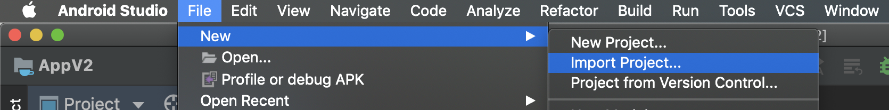
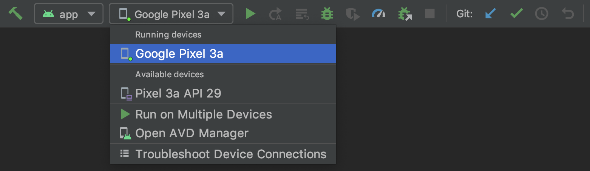
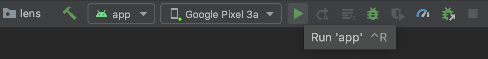

# Performance Branch

This branch is based around a `static` implementation of the TF-Lite classifier.
Note that this version is still in development and contains bugs `:(`

---

# Running TUM Lens on your Android smartphone

### 1 Activate Developer Mode
1. Open Settings app.
2. If you run Android 9 or higher, go to "About Phone" and scroll down to "Build Number". Otherwise go to "System", then "About Phone" and scroll down to "Build Number".
3. Now, **tap 7 times** on **Build Number**.

Find additional information here: https://developer.android.com/studio/debug/dev-options

### 2 Clone Repository and open it in Android Studio
1. Clone the project with `git clone ...` inside a local repository or use GitLab's "Download Source Code" option.
2. In Android Studio, choose "File", "New" and "Import Project ..." and select the `TUM_Lens` directory.

### 3 Connect your phone via cable
It should appear under "running devices" within the drop down in the upper menu bar of Android Studio.

### 4 Running the app
Build and run the app by clicking the green play button in the upper menu bar.

